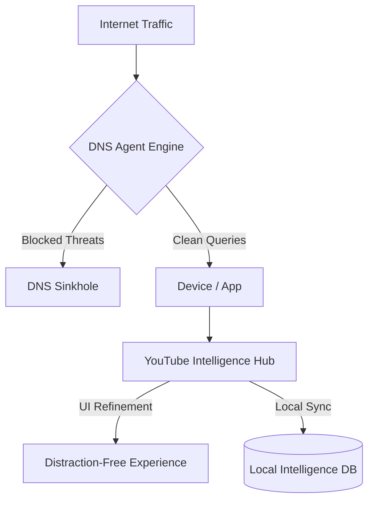
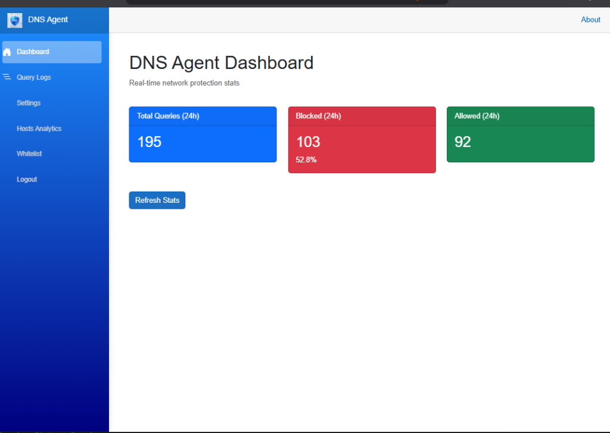

# DNS Agent - The Intelligence Shield 🛡️🚀

DNS Agent is not just a DNS server; it is a **synchronized security and intelligence engine**. By combining network-level DNS sinkholing with a surgical browser-side intelligence hub, it offers a level of network control and data ownership previously reserved for high-end enterprise suites.

---

## 🏗️ The Hybrid Architecture
Unlike traditional blockers that live only in the browser or only on the router, DNS Agent uses a **dual-engine approach** to ensure zero-leakage protection.

---

## 💎 Key Intelligence Features

### 📊 Real-Time Neural Dashboard
Our state-of-the-art dashboard provides a glassmorphic view into your network's soul. Track every query, blocked threat, and YouTube metric with sub-second latency.

> [!TIP]
> **Pro Tip**: Use the "Activity Trend" to identify which devices are generating the most background telemetry during the night.

### 🎥 YouTube Intelligence Hub
This is the most advanced part of the suite. It doesn't just block ads; it **reclaims your focus**.
- **SponsorBlock Sync**: Automatically skip sponsored segments.
- **Algorithm Circumvention**: Surgically removes watched videos and clickbait based on your *local* history.
- **Search Refinement**: Prioritizes trusted creators and hides generic "viral" noise.

### 🛡️ Per-Device Network Guard
Total visibility into every host on your network. Identify "chatty" IoT devices and isolate them with a single click.

*Featuring step-by-step interactive instructions for every device type.*

### 🖥️ Glassmorphic System Tray
The silent guardian. Monitor engine status, toggle protection, and jump to the dashboard directly from your taskbar with a modern, translucent interface.

---

## 🛠️ Technical Prowess
- **ASP.NET Core 9 / Blazor**: Built on the latest, fastest web stack for near-instant responsiveness.
- **Entity Framework Core**: High-performance SQLite backing for millions of logs with zero slowdown.
- **Windows Service Architecture**: Reliable 24/7 operation with automatic recovery.

---

## 🚀 Experience the Power
Don't just block ads—**own your network.**

[**Get Started in 60 Seconds**](README.md#quick-start-windows)
